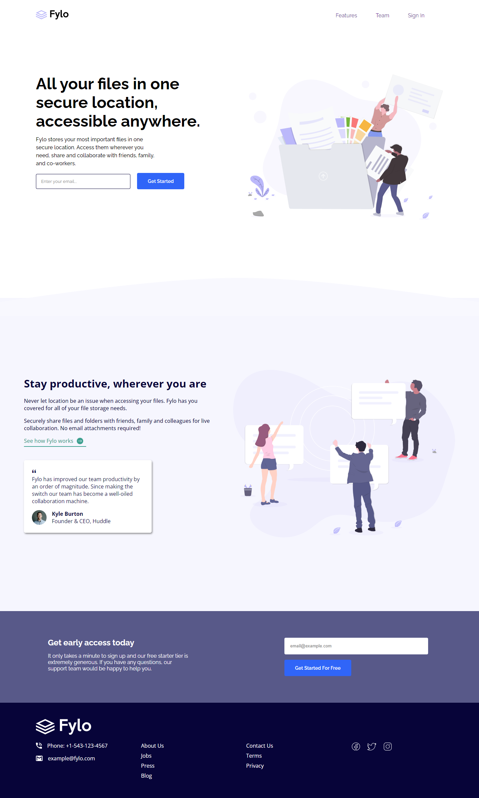
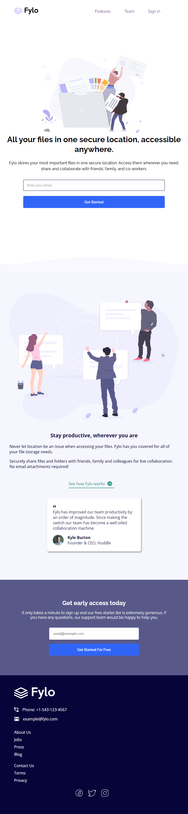
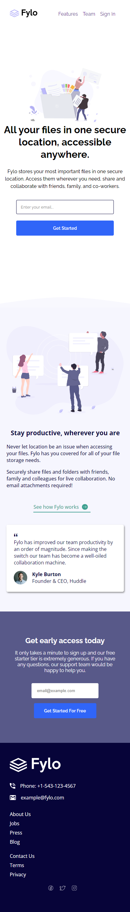

# Fylo Landing Page - Frontend Mentor Challenge

This is my solution to the Fylo landing page challenge from [Frontend Mentor](https://www.frontendmentor.io/challenges). This project showcases my ability to build a responsive landing page using HTML and CSS.

## Table of Contents

- [Overview](#overview)
  - [Screenshot](#screenshot)
  - [Links](#links)
- [My Process](#my-process)
  - [Built With](#built-with)
  - [What I Learned](#what-i-learned)
  - [Continued Development](#continued-development)
  - [Useful Resources](#useful-resources)
- [Author](#author)

## Overview

### Screenshot

#### Laptop View

#### Tab View

#### Mobile view

## My Process

### Built With

- Semantic HTML5 markup
- CSS custom properties
- Flexbox
- CSS Grid
- Mobile-first workflow

### What I Learned

During this project, I learned how to:

- Implement responsive design using media queries.
- Use CSS Grid and Flexbox to create complex layouts.
- Work with external fonts and icons.
- Structure a project with multiple CSS files for better organization.

### Continued Development

I plan to continue improving my skills in:

- Advanced CSS techniques.
- JavaScript for adding interactivity.
- Accessibility best practices.

### Useful Resources

- [MDN Web Docs](https://developer.mozilla.org/) - Comprehensive resource for web development documentation and tutorials.
- [CSS Tricks](https://css-tricks.com/) - A great site for CSS tips and tricks.
